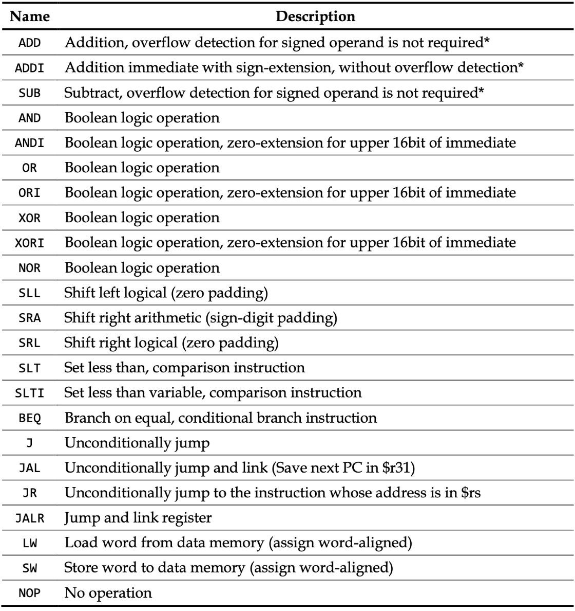

A synthesizable Verilog implementation of pipelined MIPS that supports 23 instructions and handles hazards
==
Supported instructions: 

Handled hazards: 
1.Structure hazard 
2.Data hazard 
3.Branch hazard
